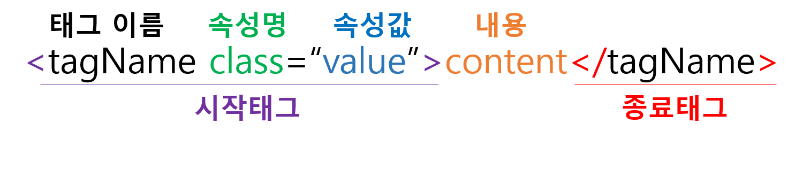

## HTML이란?
HTML은 HyperText Markup Language의 약자로, 웹 페이지를 만드는 데 사용하는 마크업 언어이다.
HTML 문서는 HTML태그로 구성되며, 각각의 태그는 웹페이지의 기능이나 디자인을 결정하는데 사용된다. 
<br /><br />

## HTML 태그
HTML 태그는 태그 이름을 꺾쇠 괄호(<>)로 감싸서 표현하며, 보통 시작 태그`<tagName>`와 종료 태그`</tagName>`의 한 쌍으로 구성된다.
태그에 따라 종료 태그가 없는 태그도 존재한다.
<br /><br />

## HTML 기본 구조
``` html
<!DOCTYPE html>
<html>
	<head>
		<title>HTML문서 타이틀</title>
	</head>
	<body>
		<h1>제목 크기1</h1>
		<h2>제목 크기2</h2>
		<p>단락</p>
	</body>
</html>
```
> `<!DOCTYPE html>` : HTML5 문서임을 명시
> `<html>` : HTML 문서의 루트 요소 정의
> `<head>` : HTML 문서의 메타데이터(metadata) 정의
> `<title>` : HTML 문서의 제목을 정의
> `<body>` : 웹 브라우저를 통해 보이는 내용 부분
<br /><br />

## HTML 태그 구조

html 태그는 여러 속성을 가질 수 있으며, 속성은 해당 태그에 대한 추가적인 정보를 제공한다.
속성은 시작 태그 내에서만 정의되며, 속성 이름과 속성값(value)으로 표현된다.
```
문법
<태그이름 속성명="속성값"></태그이름>
```

### :bangbang: 주의사항
* 속성 이름은 소문자로 작성
* 속성값은 항상 따옴표로 감싸줄 것
<br /><br />

## 출처
 [TCP SCHOOL HTML](http://www.tcpschool.com/html/intro)